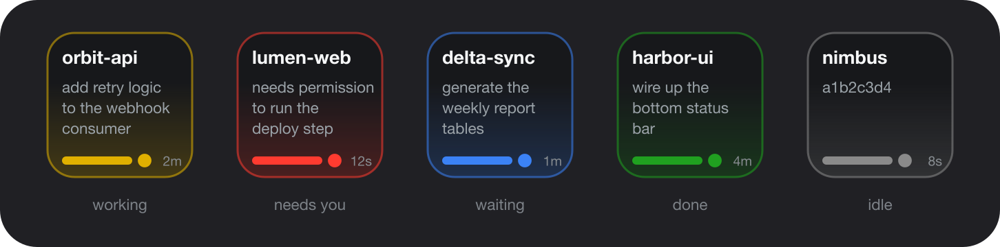

# Claude Code status on your Stream Deck

Turn your Elgato Stream Deck into a live status board for [Claude Code](https://claude.com/claude-code) sessions running in **Zed**, **[Jean](https://jean.build)**, or a **terminal**. One key per active session - the colour tells you what each agent is doing at a glance, and a tap jumps you straight to that session (opens the project in Zed, or brings Jean to the front).



- 🟡 **working** - 🔴 **needs you** (permission) - 🔵 **waiting** (idle) - 🟢 **done** - ⚪ **idle**
- **Tap** a key -> open that session (project in Zed, or the Jean app)  -  **Hold** -> dismiss the key
- Keys that need your attention **blink**; each shows the **repo name**, **session name**, and **elapsed time**

  

---

## Why

When you run several coding agents at once, you lose track of which one is thinking, which is blocked waiting for a permission, and which is done. This puts that state on physical keys next to your keyboard - no window switching, no hunting through tabs.

## How it works

```
Claude Code (Zed / Jean / terminal)
        |  lifecycle hooks (SessionStart, UserPromptSubmit, PreToolUse,
        |  Notification, PermissionRequest, Stop, SessionEnd)
        v
~/.claude/agent-status.sh   --writes-->  ~/.claude/agent-status.d/<session>.json
        |  POST 127.0.0.1:37800 (instant repaint)
        v
Stream Deck plugin  --reads status dir, paints one key per session-->  🎛️
```

- **Hooks** fire on Claude Code lifecycle events and run a small shell helper.
- The **helper** writes one JSON file per session (state, cwd, session name, pid, timestamps, host).
- The **plugin** watches that directory (push + 5 s backstop poll), maps live sessions onto the keys you placed, and renders each one. Tap opens the session (project in Zed, or the Jean app for Jean sessions); hold deletes the record.

## States

| Key | State | Fired by | Blinks |
|-----|-------|----------|--------|
| 🟡 amber | working / thinking | `UserPromptSubmit`, `PreToolUse` | no |
| 🔴 red | needs permission | `PermissionRequest`, permission `Notification` | **yes** |
| 🔵 blue | waiting for input (idle) | idle `Notification` | **yes** |
| 🟢 green | turn done | `Stop` | no |
| ⚪ grey | idle (just started) | `SessionStart` | no |

The session name is the **first prompt** you sent in that session. Elapsed time shows turn duration while working, and time-since for the other states.

## Requirements

- macOS + [Elgato Stream Deck app](https://www.elgato.com/stream-deck)
- [Claude Code](https://claude.com/claude-code)
- [`jq`](https://jqlang.github.io/jq/) and Node.js (`brew install jq node`)
- [Zed](https://zed.dev) and/or [Jean](https://jean.build) (optional - only needed for the tap-to-open feature; each session opens in whichever launched it)

## Install

```bash
git clone https://github.com/quados/streamdeck-claude-status.git
cd streamdeck-claude-status
./install.sh
```

`install.sh` copies the helper to `~/.claude/`, installs the plugin's npm deps, and links the plugin into Stream Deck. Then:

1. **Add the hooks.** Merge [`hooks/settings.snippet.json`](hooks/settings.snippet.json) into the `"hooks"` object of `~/.claude/settings.json`. If an event already exists (you use other hooks), append the `agent-status.sh` command to that event's existing `hooks` array instead of replacing it.
2. **Restart Stream Deck:**
   ```bash
   osascript -e 'quit app "Elgato Stream Deck"'; sleep 3; open -a "Elgato Stream Deck"
   ```
3. **Place keys.** In the Stream Deck app, drag **Custom -> Claude Code -> Agent Session** onto as many keys as you want concurrent sessions visible. Slots fill left->right, top->bottom.

Now use Claude Code - a key lights up per session.

## Usage

- **Tap** a key - opens that session in the app that launched it. Zed/terminal sessions open the project directory in Zed (`zed <cwd>`, falling back to `open -a Zed`); Jean sessions bring the Jean app to the front (Jean has no folder deep-link, and the session already lives inside the app).
- **Hold** a key (~0.6 s) - dismisses it (deletes the status record). Use this after you archive/close a thread.
- Sessions are ordered by project path, so a project keeps the same slot (muscle memory).

## Configuration

All knobs are constants at the top of [`com.eduard.claudestatus.sdPlugin/bin/plugin.js`](com.eduard.claudestatus.sdPlugin/bin/plugin.js) - edit, then restart Stream Deck:

| Constant | Default | Meaning |
|----------|---------|---------|
| `COLOR` | - | per-state accent colours |
| `ATTENTION` | `{perm, wait}` | which states blink |
| `IDLE` | 24 h | hide non-busy sessions idle longer than this |
| `STUCK` | 20 min | hide a `busy` session with no tool activity this long (crash guard) |
| `BLINK` | 700 ms | blink period |
| `LONG` | 600 ms | long-press threshold to dismiss |
| `PORT` | 37800 | localhost push port (must match the helper) |
| `ZED_CLI` | Zed CLI path | binary run on tap for Zed/terminal sessions |

## Works with

Hooks fire for **any** Claude Code frontend - Zed's ACP integration, the [Jean](https://jean.build) desktop app, the terminal CLI, etc. Jean sessions are detected automatically (Jean exports `JEAN_SESSION_ID` into the session), so their keys open Jean on tap. To confirm hooks fire in your setup, run a prompt and check that a file appears:

```bash
ls ~/.claude/agent-status.d/
```

## OKF knowledge bundle

This repo ships an [Open Knowledge Format](https://github.com/GoogleCloudPlatform/knowledge-catalog/blob/main/okf/SPEC.md) bundle under [`okf/`](okf/) - an agent-readable description of the architecture, state model, and components. Point a knowledge/consumption agent at it to understand or extend the project.

## Troubleshooting

- **Keys stay blank** - hooks aren't firing. Confirm `~/.claude/agent-status.d/` gets files; check the hooks are in `settings.json`; make sure `jq` is installed.
- **Tap does nothing** - for Zed/terminal sessions, Zed isn't installed or its CLI isn't at the path in `ZED_CLI` (the plugin falls back to `open -a Zed`; make sure Zed.app exists, or edit `ZED_CLI`). For Jean sessions, make sure Jean.app is named `Jean` (the plugin runs `open -a Jean`).
- **Debug which hooks fire** - run `./scripts/watch-status.sh` and use Claude Code; the live view shows each session's state changing (handy to confirm `perm`/`wait` trigger in your frontend).
- **Plugin won't load** - after editing `plugin.js`, fully quit Stream Deck (wait ~5 s) *then* reopen; a quick quit+open can orphan the process. Logs: `com.eduard.claudestatus.sdPlugin/logs/`.
- **A stale key won't clear** - hold it to dismiss, or `rm ~/.claude/agent-status.d/<session>.json`.

## Forking / renaming

The plugin UUID is `com.eduard.claudestatus`. If you publish your own build, rename the `.sdPlugin` folder, the `UUID`/action `UUID` in `manifest.json`, and the action UUID referenced in `bin/plugin.js`, then re-link.

## License

MIT - see [LICENSE](LICENSE).
